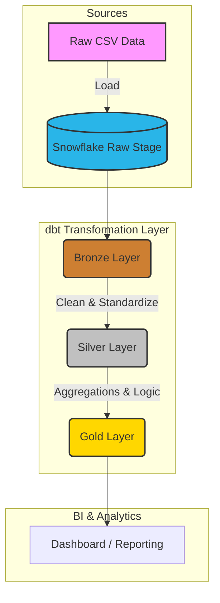

# Airbnb End-to-End Data Engineering Project


## 📖 Overview

Welcome to the **Airbnb End-to-End Data Engineering Project**. This repository hosts a robust data pipeline designed to ingest, process, and transform Airbnb data into actionable insights using modern data engineering practices.

The project leverages **dbt (data build tool)** for transformation and **Snowflake** as the data warehouse, following a layered architecture (Bronze, Silver, Gold) to ensure data quality and lineage.

---

## 🏗 Architecture

The data flows from raw CSVs through a structured Medallion Architecture:



### Data Layers
- **Bronze**: Raw data ingestion with minimal transformation.
- **Silver**: Cleaned, deduplicated, and standardized data.
- **Gold**: Business-level aggregates and metrics ready for reporting.

---

## 📂 Project Structure

```bash
.
├── Data/                       # Raw input data (Bookings, Hosts, Listings)
├── aws_dbt_snowflake_project/  # Main dbt project directory
│   ├── models/                 # SQL models for Bronze, Silver, Gold layers
│   ├── macros/                 # Reusable SQL logic
│   ├── tests/                  # Data quality tests
│   ├── snapshots/              # Type 2 Slowly Changing Dimensions (SCD)
│   └── dbt_project.yml         # dbt project configuration
├── pyproject.toml              # Python dependencies and configuration
└── README.md                   # Project documentation
```

---

## 🚀 Getting Started

### Prerequisites
- **Python 3.12+**
- **Snowflake Account**
- **dbt CLI** (installed via dependencies)

### Installation

1. **Clone the repository**
   ```bash
   git clone https://github.com/umerfaisall/airbnb-end-to-end-data-engineering-project.git
   cd airbnb-end-to-end-data-engineering-project
   ```

2. **Install Dependencies**
   It is recommended to use a virtual environment.
   ```bash
   # Create virtual environment
   python -m venv .venv
   source .venv/bin/activate  # Windows: .venv\Scripts\activate

   # Install requirements
   pip install -e .
   ```
   *Alternatively, if using `uv`:*
   ```bash
   uv sync
   ```

3. **Configure dbt**
   Ensure your `profiles.yml` is set up correctly in `~/.dbt/` or within the project directory. Updates required for connection to your Snowflake instance:
   ```yaml
   aws_dbt_snowflake_project:
     target: dev
     outputs:
       dev:
         type: snowflake
         account: <your_account>
         user: <your_user>
         password: <your_password>
         role: <your_role>
         database: <your_database>
         warehouse: <your_warehouse>
         schema: <your_schema>
         threads: 4
   ```

---

## 🏃‍♂️ Running the Pipeline

Navigate to the dbt project directory:
```bash
cd aws_dbt_snowflake_project
```

### 1. Verification
Check if dbt can connect to Snowflake:
```bash
dbt debug
```

### 2. Run Models
Execute the transformation pipeline:
```bash
dbt run
```
*To run a specific layer:*
```bash
dbt run --select tag:bronze
```

### 3. Test Data Quality
Run defined tests to ensure data integrity:
```bash
dbt test
```

### 4. Generate Documentation
Create and view the dbt documentation site:
```bash
dbt docs generate
dbt docs serve
```

---

## 📊 Data Dictionary

| Dataset | Description |
| :--- | :--- |
| **Bookings** | Reservation details including dates, prices, and status. |
| **Hosts** | Information about property hosts and their attributes. |
| **Listings** | Detailed property information, location, and specifications. |

---

## 🤝 Contributing

Contributions are welcome! Please fork this repository and submit a pull request for any enhancements or bug fixes.

---

## 📄 License

This project is licensed under the MIT License.
